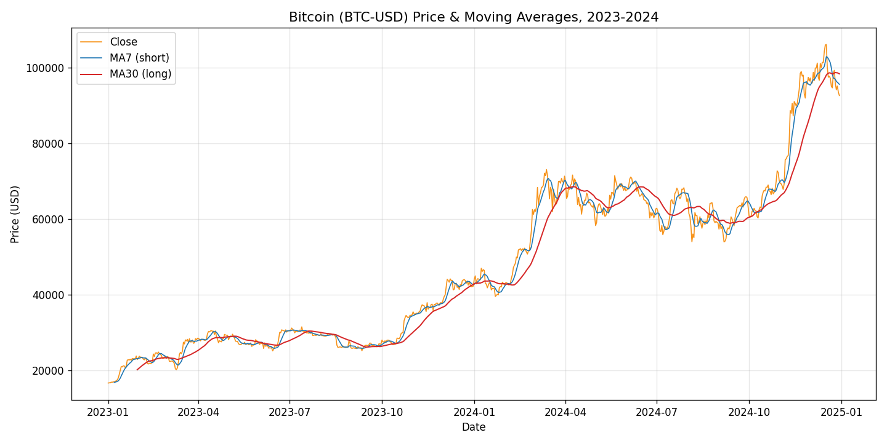
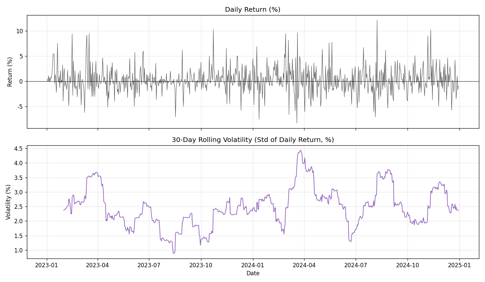
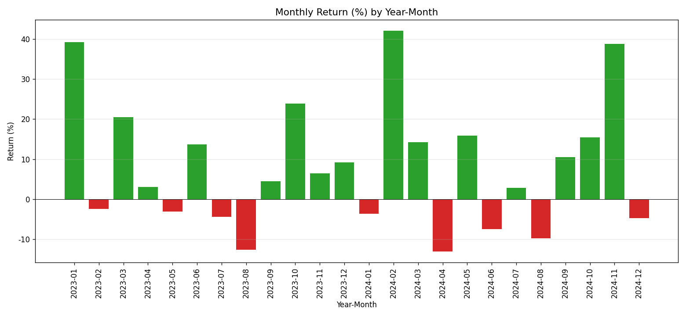
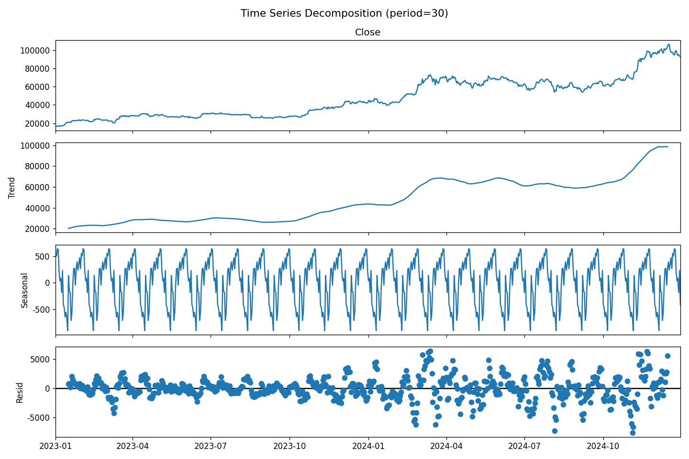
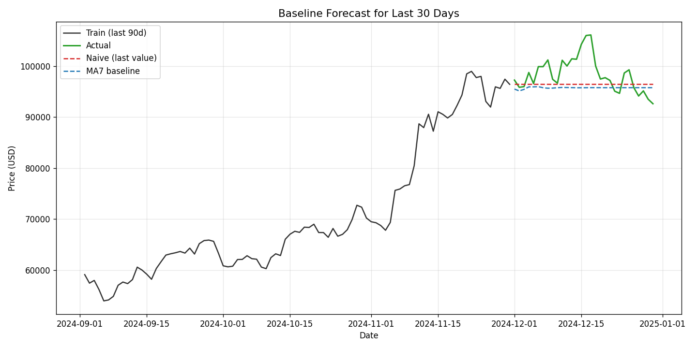

# 비트코인(BTC-USD) 2023~2024년 가격 시계열 분석 리포트

## 1. 분석 주제 및 선정 이유

- 분석 대상: **비트코인(BTC-USD) 일별 가격**, 2023-01-01 ~ 2024-12-30
- 선정 이유:
  - 2023~2024년은 비트코인에 **현물 ETF 승인(2024년 1월)**, **네 번째 반감기(2024년 4월)** 등 굵직한 이벤트가 몰린 시기라, 가격 흐름에서 "추세 변화가 실제로 있었는지"를 데이터로 확인하기에 적합하다.
- 변동성이 크고 24시간·연중무휴로 거래되어, 이동평균·변화율·변동성 같은 시계열 기법을 적용했을 때 패턴이 뚜렷하게 드러난다.
- `yfinance`로 누구나 동일한 데이터를 재현할 수 있어, 재현성 조건을 만족한다.

## 2. 분석 질문 (3개 이상)

1. 2023~2024년 전체적으로 상승/하락 중 어떤 추세가 우세했는가? (그래프로 확인 가능)
2. 급등·급락 구간은 언제이며, 외부 이벤트(ETF 승인, 반감기 등)와 연결해볼 수 있는가? (추가 해석 필요)
3. 월별로 수익률 패턴에 차이가 있는가? 유리하거나 불리한 시기가 존재하는가? (그래프 + 해석)
4. (보너스) 시계열을 추세/계절성/잔차로 분해했을 때 무엇이 보이며, 단순 베이스라인으로 미래를 예측하면 어떤 한계가 드러나는가?

## 3. 데이터 설명

| 항목 | 내용 |
|------|------|
| 출처 | Yahoo Finance (`yfinance` 라이브러리, 티커 `BTC-USD`) |
| 기간 | 2023-01-01 ~ 2024-12-30 |
| 데이터 수 | **730개** 데이터 포인트(일별) |
| 컬럼 | Open, High, Low, Close, Volume |
| 결측치 | **없음** (0건) |
| 라이선스 주의 | Yahoo Finance 데이터는 개인 학습·연구 목적 사용. 상업적 재배포 시 별도 확인 필요 |

**정제 및 이상치 처리 기준**
- 결측치: 조회 결과 0건. 다만 방어적으로, 결측 발생 시 가격 데이터 특성상 **전방 채움(ffill)** 을 적용하는 규칙을 코드에 명시했다.
- 이상치: 일간 수익률 기준 **|z-score| > 3** 인 날을 후보로 식별한 결과 **12일**이 검출되었다. 이 날들은 실제 시장 급변(예: ETF 승인 직후, 급락일)에 해당하는 "진짜 신호"이므로 **제거하지 않고 관찰용으로 보존**했다. 이상치를 무조건 삭제하면 분석하려는 급등·급락 패턴 자체가 사라지기 때문이다.

## 4. 분석 결과 및 시각화

### 시각화 1 — 가격 추세와 이동평균 (필수)


- 종가에 **7일(단기)·30일(장기) 이동평균**을 겹쳐, 노이즈를 제거한 추세를 확인한다.
- 단기선(MA7)이 장기선(MA30)을 위로 뚫는 구간에서 상승 추세가, 아래로 뚫는 구간에서 하락/횡보가 나타난다.

### 시각화 2 — 일간 수익률과 30일 롤링 변동성 (필수)


- 위: 일간 변화율(%), 아래: 30일 롤링 표준편차(변동성).
- 변동성이 특정 구간에 몰려 있는 **변동성 군집(volatility clustering)** 현상을 관찰할 수 있다.

### 시각화 3 — 연-월별 수익률 (권장)


- 24개월 각각의 월간 수익률을 막대로 표현(초록=상승, 빨강=하락).
- 상승한 달과 하락한 달의 분포, 그리고 특정 달의 큰 변동을 한눈에 볼 수 있다.

### 시각화 4 — 시계열 분해 (보너스 A)


- 종가를 **추세(Trend) / 계절성(Seasonal, 30일 주기 가정) / 잔차(Residual)** 로 분해했다.
- 추세 성분이 전체 흐름을 지배하며, 30일 주기 계절성은 진폭이 작다.

### 시각화 5 — 베이스라인 예측 (보너스 B)


- 마지막 30일을 테스트 구간으로 두고, 두 가지 단순(naive) 방식으로 예측했다.
  - Naive: 직전 관측값을 그대로 연장(랜덤워크 가정)
  - MA7: 직전 7일 평균을 다음날 예측값으로 사용
- 오차(MAE): **Naive 약 2,950 USD / MA7 약 3,260 USD**

## 5. 인사이트 (관찰 → 해석 → 행동)

### 인사이트 1: 2년간 강한 상승 추세 (+457%)
- **관찰(Fact)**: 종가는 2023-01-01 약 **16,625 USD**에서 2024-12-30 약 **92,643 USD**로, 전체 **+457.2%** 상승했다. 연도별로는 2023년 +154.2%, 2024년 +109.8%로 두 해 모두 큰 폭 상승했다. 역대 최고 종가는 2024-12-17의 **약 106,141 USD**였다.
- **해석(Why)**: 2022년 급락 이후의 회복 국면에, 2024년 현물 ETF 승인·반감기라는 구조적 이벤트가 겹치며 상승 추세가 강화된 것으로 보인다. (가설이며, 가격 데이터만으로 인과를 단정할 수는 없다.)
- **행동(Action)**: 상승 추세를 전제로 한 분석이 유효하나, 이후 구간에서 추세가 유지되는지 이동평균 교차로 지속 점검할 필요가 있다.

### 인사이트 2: 급등 구간은 외부 이벤트와 시점이 겹친다
- **관찰(Fact)**: 월별 수익률에서 **2024년 2월이 +42.1%로 최고**, 2023년 1월(+39.3%), 2024년 11월(+38.9%)이 뒤를 이었다. 2024년 1~3월 동안에만 가격이 44,167 → 71,334 USD로 **+61.5%** 급등했다.
- **해석(Why)**: 2024년 1월 미국 현물 ETF 승인 직후 자금 유입 기대가, 11월 급등은 시장 심리 변화가 배경일 수 있다. 시점의 일치는 강한 정황이지만, 다른 거시 변수(금리·유동성)를 통제하지 않았으므로 상관을 인과로 확정할 수는 없다.
- **행동(Action)**: 급등 구간을 이벤트 캘린더와 겹쳐 보는 이벤트 스터디로 후속 분석하면 설득력을 높일 수 있다.

### 인사이트 3: 상승한 달이 하락한 달보다 많고, 상승폭도 더 크다
- **관찰(Fact)**: 24개월 중 **상승 15개월 / 하락 9개월**. 상승한 달의 평균 수익률은 **+17.3%**, 하락한 달은 **−6.8%** 로, 상승폭이 하락폭보다 크다. 가장 나쁜 달은 2024년 4월(−13.0%)이었다.
- **해석(Why)**: 상승장 특유의 **비대칭 수익 분포**(큰 상승 + 작은 조정)로 볼 수 있다. 다만 이는 특정 강세장 2년 구간의 특성이며, 약세장에서는 반대로 나타날 수 있다.
- **행동(Action)**: 이 비대칭성이 다른 기간(예: 2021~2022 약세장)에도 유지되는지 확인하면 일반화 가능성을 검증할 수 있다.

### 인사이트 4: 변동성은 상시가 아니라 특정 구간에 군집한다
- **관찰(Fact)**: 일간 수익률 표준편차는 평균 **2.56%**(연율화 약 48.9%)다. 최대 일간 상승은 2024-08-08의 **+12.14%**, 최대 하락은 2024-03-19의 **−8.34%**였다. 30일 롤링 변동성은 2024-03-26에 **4.43%**로 최고, 2023-08-13에 **0.89%**로 최저였다.
- **해석(Why)**: 변동성이 큰 날이 특정 시기에 몰리는 **변동성 군집** 현상으로, 시장 이벤트가 밀집한 시기에 위험이 집중됨을 시사한다.
- **행동(Action)**: 변동성이 높은 구간을 사전 식별하는 지표(예: 롤링 변동성 임계값)를 리스크 관리에 활용할 수 있다.

## 6. 결론 및 한계점

**결론**
- 2023~2024년 비트코인은 명확한 **상승 추세**(+457%)를 보였고, 급등 구간은 ETF 승인·반감기 등 외부 이벤트 시점과 겹쳤다. 수익 분포는 상승에 비대칭적으로 유리했으며, 변동성은 특정 구간에 군집했다. 시계열 분해에서도 흐름을 지배하는 것은 **추세 성분**이었다.

**한계점**
- **외부 변수 미반영**: 금리·거시경제·규제 등을 변수로 넣지 않아, 이벤트와 가격의 관계는 상관 관찰에 그친다(인과 아님).
- **단일 지표 한계**: 종가 중심 분석으로, 거래량·온체인 데이터 등은 활용하지 않았다.
- **예측의 한계**: 베이스라인 예측은 "직전 값이 유지된다"는 단순 가정에 기반하므로 급변 구간에서 오차가 크다. 정확한 예측 도구가 아니라 **비교 기준(baseline)** 으로만 의미가 있다.
- **기간 편향**: 분석 구간이 강세장 2년에 국한되어, 약세장을 포함하면 결론이 달라질 수 있다.

## 7. 재현 방법 (실행 순서)

```bash
# 1) 의존성 설치
pip install -r requirements.txt

# 2) 분석 실행 (데이터 수집 → 정제 → 시각화 → 분해/예측)
python analysis.py
```

- 실행 시 `data/btc_2023_2024.csv`가 없으면 자동으로 다운로드하며, 있으면 재사용해 동일한 결과를 재현한다.
- 그래프는 `images/` 폴더에 5개의 PNG로 저장된다.

## 8. AI 사용 로그

본 과제는 데이터 분석과 리포트 작성 과정에서 AI(생성형 언어모델)를 보조 도구로 활용했다. 사용 내역은 아래와 같다.

| 사용 작업 | 사용 이유 | 검증 방법 |
|-----------|-----------|-----------|
| 시각화 코드 작성(matplotlib) | 반복적인 그래프 스타일링 코드를 빠르게 작성해 시간 절감 | 생성된 코드를 직접 실행해 그래프가 의도대로 그려지는지 눈으로 확인하고, 축·범례·색상을 수정 |
| 시계열 분석 기법 적용(이동평균·변화율·롤링 변동성·분해) | 적절한 기법 선택과 파라미터(윈도우 크기 등)에 대한 대안 탐색 | 계산 결과를 원본 데이터로 샘플링 재계산해 수치가 맞는지 교차 확인 |
| 인사이트 문장 다듬기 | 관찰과 해석을 구분해 명료하게 서술하기 위한 문장 정리 | 리포트에 인용된 모든 수치를 스크립트 출력값과 대조해, 실제 데이터와 일치하는지 확인 |

- 본문에 기재된 모든 수치(수익률, 변동성, 날짜 등)는 **AI가 임의로 생성한 값이 아니라 실제 데이터를 분석한 스크립트의 출력을 검증한 결과**다.
- 최종 해석·결론은 데이터 근거를 바탕으로 직접 판단해 작성했다.
